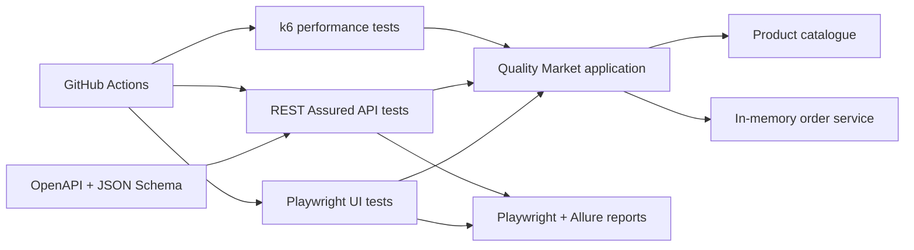

# Full-Stack QA Automation Framework

A self-contained quality engineering project by **Gizem Demirtas**. It demonstrates how UI, API, contract and performance tests can be combined into repeatable CI/CD quality gates.

## What this project proves

- **UI automation:** Playwright + TypeScript, Page Object Model, parallel Chromium/Firefox execution
- **API automation:** Java 17+, REST Assured, JUnit 5, positive and negative test design
- **Contract testing:** OpenAPI 3.1 and JSON Schema validation
- **Performance testing:** k6 scenarios, checks and release thresholds
- **Reporting:** Playwright HTML plus unified Allure result generation
- **DevOps:** Docker, Docker Compose and GitHub Actions with test artifacts
- **Quality engineering:** deterministic test data, environment configuration, retries, traces and measurable quality gates

## Architecture



The application uses only Node.js core modules, so the framework remains focused on test architecture instead of application dependencies.

## Repository layout

```text
app/                       Self-contained storefront and REST API
ui-tests/                  Playwright specs and page objects
api-tests/                 Maven, JUnit and REST Assured suite
contracts/openapi.yaml     OpenAPI 3.1 service contract
performance-tests/         k6 load scenario and thresholds
docs/TEST_STRATEGY.md      Risk model and quality gates
.github/workflows/         CI pipeline
docker-compose.yml         Reproducible local stack
```

## Run locally

On macOS, double-click `run-local.command` and open [http://localhost:3000](http://localhost:3000). To run it from Terminal instead:

```bash
npm start
```

### Prerequisites

- Node.js 20+
- Java 17+ and Maven 3.9+
- Playwright browser binaries
- k6 for local performance execution (or Docker)

### UI tests

```bash
npm ci
npx playwright install chromium firefox
npm run typecheck
npm run test:ui
```

Playwright starts the application automatically. The HTML report is written to `playwright-report/`, while Allure results are written to `allure-results/`.

### API and contract tests

Start the application in one terminal:

```bash
npm start
```

Run the Java suite in another terminal:

```bash
npm run test:api
```

The API base URL can be overridden with `API_BASE_URL`.

### Performance tests

With the application running:

```bash
npm run test:performance
```

The k6 quality gate requires less than 1% failed requests, more than 99% successful checks and p95 response time below 500 ms.

### Docker Compose

Run each quality layer in a reproducible environment:

```bash
docker compose up --build --abort-on-container-exit ui-tests
docker compose up --build --abort-on-container-exit api-tests
docker compose up --build --abort-on-container-exit performance-tests
```

## Test design highlights

- Page objects isolate selectors and user actions from assertions.
- Accessible roles and stable `data-testid` attributes are used instead of fragile CSS paths.
- API tests cover retrieval, filtering, creation, negative validation and an end-to-end order lifecycle.
- Contract assertions prevent unnoticed response-shape drift.
- Environment variables keep the same suites portable across local, Docker and CI environments.
- Failed UI runs retain traces, screenshots and videos for root-cause analysis.
- CI runs each test layer independently and uploads reports even when a gate fails.

## Reports

Generate a combined local Allure report after running UI and API suites:

```bash
npm run report:allure
npm run report:open
```

## Roadmap

- Add authentication and role-based access scenarios
- Add accessibility testing with axe-core
- Publish trend history for flaky-test and duration metrics
- Add a cloud test environment and scheduled nightly regression

## References

- [Playwright documentation](https://playwright.dev/docs/intro)
- [REST Assured documentation](https://rest-assured.io/)
- [Allure Playwright integration](https://allurereport.org/docs/playwright/)
- [Grafana k6 documentation](https://grafana.com/docs/k6/latest/)

## Author

**Gizem Demirtas** — QA Automation Engineer / Software Test Engineer

- GitHub: [gizemdemirtaass](https://github.com/gizemdemirtaass)
- Medium: [@gizemdemirtas](https://medium.com/@gizemdemirtas)
